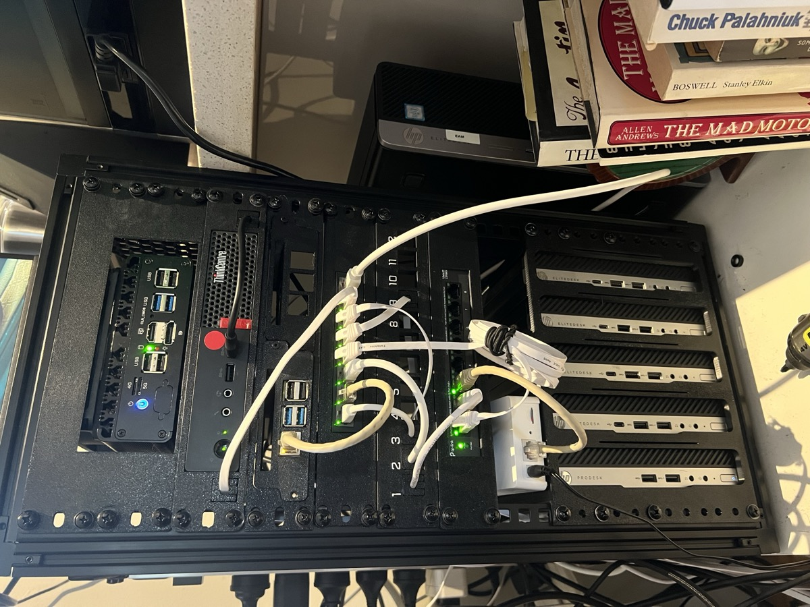

# Mabuhay! 👋

I'm a Filipino IT professional based in Melbourne, Australia 🇵🇭🇦🇺

## 🧑‍💻 About Me

- 🖥️ **Day Job:** .NET | SpecFlow | Selenium | Selenoid  
- 💻 **Latest Project(s):**
  - [vinnymarquez.dev (V4)](https://vinnymarquez.dev)
  - [*ARRgh!](https://github.com/t2vi/arrgh)
  - [spoolbook](https://github.com/t2vi/spoolbook)
- 🧪 **Interests:** Automation, DevOps, Homelabs, UI/UX  

## 🏠 Homelab
Part playground, part production — a 3-node Proxmox cluster behind OPNsense, with a private ~75-page runbook wiki (Astro/Starlight) behind it.

⚡ View Setup

### 🔐 Networking

| Device | Specs | Role |
|-------|------|------|
| Topton Intel N150 | 16GB / 256GB NVMe | OPNsense — router/firewall |
| TP-Link LS1008G | 8-port | Unmanaged switch — VLAN cutover pending a MikroTik CRS326 |
| TP-Link LS108GP | 8-port PoE | Unmanaged PoE switch |
| TP-Link VR2100v | — | Access point |
| 2x Eero 6 + 2x Extender | — | Mesh Wi-Fi |

A single flat LAN today; the full VLAN plan is built in OPNsense, waiting on the managed switch to cut over.

### 🧠 Compute — 3-node Proxmox cluster

| Device | Specs | Runs |
|--------|-------|------|
| Lenovo M910q Tiny | 16GB / i5-7500T | *Arr stack + gluetun VPN gateway, Seerr, Home Assistant OS (VM) |
| HP EliteDesk 800 G5 mini | 16GB / i5-9500T | Docker + Podman (Portainer), k3s practice VM, Prometheus/Grafana, Immich, Technitium DNS (primary) |
| HP EliteDesk 800 G5 mini | 16GB / i5-9500T | Plex, Homepage, Vaultwarden, Paperless-ngx, step-ca (internal PKI), + misc self-hosted apps |

Outside the cluster:

| Device | Specs | Role |
|--------|-------|------|
| Raspberry Pi 4B | 8GB, bare metal | Technitium DNS — secondary node (replaced Pi-hole) |
| HP EliteDesk 400 G3 SFF | 16GB / i5-6500 | TrueNAS (ZFS, ~8TB) — media, photo originals, document archive over SMB |

**Remote access:** Cloudflare Tunnel (CGNAT workaround) for Plex, Seerr, Immich, Vaultwarden, Home Assistant and a public dashboard — admin surfaces gated behind Cloudflare Access + Google OAuth.

**\*Arr stack:** Radarr, Sonarr, Lidarr, Prowlarr, Bazarr, qBittorrent, all VPN-gated through gluetun (Proton VPN) with an LXC-level kill switch.

### 🛠️ On deck

- Dedicated bare-metal **Talos + Kubernetes** cluster from spare EliteDesk minis (Longhorn storage, GitOps) — migrating the "cattle" workloads off Proxmox
- Managed switch → VLAN segmentation cutover
- Self-hosted git (Forgejo) once the k8s cluster is up
- 10" DIY rack (HLR1019) + a BC-250 HTPC build

## 🌐 More About Me

👉 https://vinnymarquez.dev
